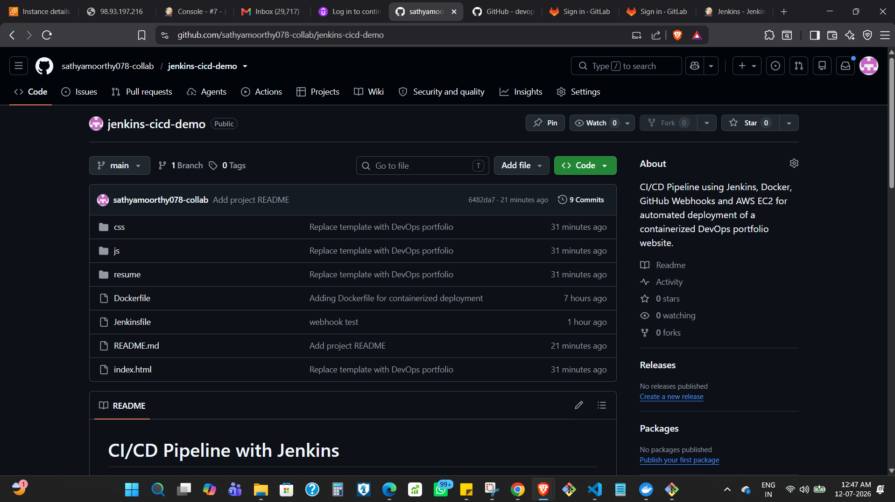
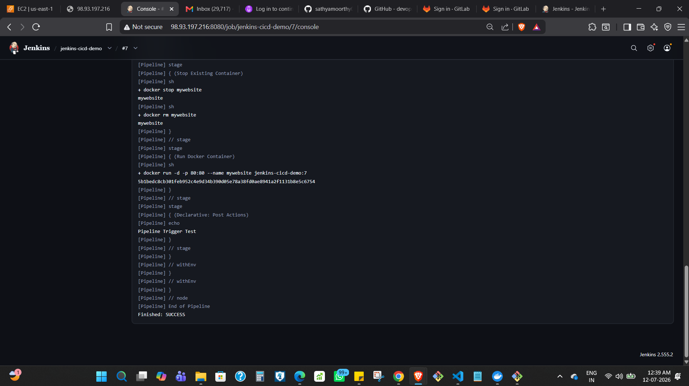
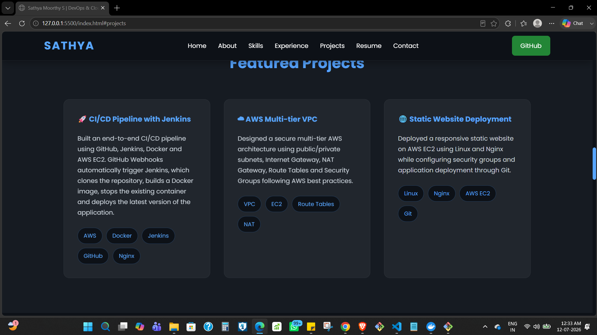
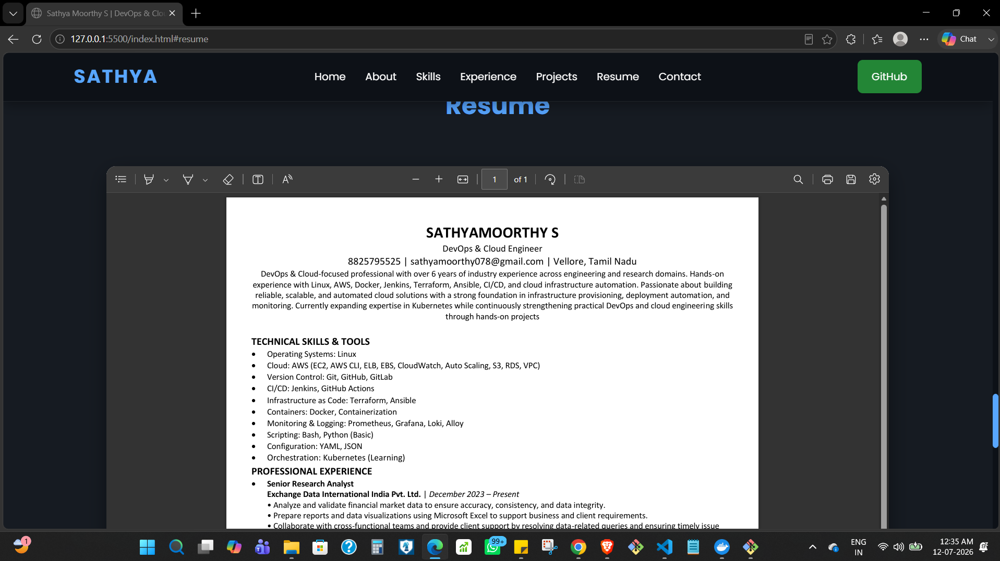

# CI/CD Pipeline with Jenkins, Docker, and AWS EC2

## Overview

This project implements an automated CI/CD workflow for deploying a containerized static portfolio website to an AWS EC2 instance.

The application is served by Nginx inside a Docker container. Source code is maintained in GitHub, and a GitHub Webhook triggers Jenkins when changes are pushed to the repository. The Jenkins pipeline retrieves the latest source code, builds a new Docker image, removes the previously running application container, and starts a new container with the updated version.

The project was built to gain hands-on experience with Jenkins Pipeline as Code, webhook-based automation, Docker containerization, and application deployment on AWS EC2.

## Architecture


The deployment flow is:

1. Application code is pushed to the GitHub repository.
2. A GitHub Webhook sends a request to Jenkins.
3. Jenkins starts the pipeline defined in the `Jenkinsfile`.
4. Jenkins retrieves the latest source code.
5. Docker builds a new image containing the static website and Nginx.
6. The existing application container is stopped and removed.
7. A new container is started from the newly built image.
8. Nginx serves the updated website from the EC2 instance.

This approach automates the application deployment process after the initial Jenkins, Docker, webhook, and EC2 configuration has been completed.

## Technology Stack

| Technology      | Role in the Project                                    |
| --------------- | ------------------------------------------------------ |
| Git             | Source code version control                            |
| GitHub          | Repository hosting and source code management          |
| GitHub Webhooks | Automatically triggers the Jenkins pipeline            |
| Jenkins         | Executes the CI/CD pipeline                            |
| Jenkinsfile     | Defines the deployment workflow as code                |
| Docker          | Builds and runs the application as a container         |
| Nginx           | Serves the static portfolio website                    |
| AWS EC2         | Hosts Jenkins and the deployed application environment |
| Linux           | Operating environment for the EC2 instance             |

## Key Features

* Jenkins Pipeline defined as code using a `Jenkinsfile`
* Automatic pipeline triggering through GitHub Webhooks
* Docker image creation as part of the deployment workflow
* Containerized static website served through Nginx
* Automated replacement of the existing application container
* Deployment hosted on an AWS EC2 instance

## Repository Structure

```text
jenkins-cicd-demo/
│
├── Dockerfile
├── Jenkinsfile
├── README.md
├── index.html
├── css/
├── js/
├── images/
├── resume/
└── screenshots/
```

The two main deployment files are:

* `Dockerfile` — defines the container image used to serve the static website through Nginx.
* `Jenkinsfile` — defines the Jenkins pipeline responsible for building and redeploying the application.

## Deployment Workflow

The deployment begins when a code change is pushed to GitHub.

### 1. Source Code Update

Changes to the portfolio application are committed and pushed to the GitHub repository.

### 2. Webhook Trigger

A GitHub Webhook is configured to notify Jenkins when repository changes occur. This removes the need to manually start the Jenkins job for each deployment.

### 3. Jenkins Pipeline Execution

Jenkins executes the pipeline defined in the repository's `Jenkinsfile` and retrieves the latest application source code.

### 4. Docker Image Build

The pipeline builds a new Docker image using the project's `Dockerfile`. The image packages the static website with Nginx as the web server.

### 5. Existing Container Replacement

The previously running application container is stopped and removed before the updated version is deployed.

### 6. Updated Container Deployment

Jenkins starts a new Docker container from the newly built image. Nginx then serves the updated portfolio website from the EC2 instance.

## Technical Decisions and Considerations

### Pipeline as Code

The CI/CD workflow is stored in a `Jenkinsfile` alongside the application source code rather than being defined only through the Jenkins UI.

This keeps the pipeline configuration version-controlled and allows deployment changes to be tracked together with application changes.

### GitHub Webhook Trigger

A webhook was used to connect GitHub and Jenkins so that repository changes automatically initiate the deployment pipeline.

This reduces the manual step of logging into Jenkins and starting a build after every code update.

### Docker-Based Deployment

The website is packaged into a Docker image with Nginx instead of copying application files directly onto the EC2 host during each deployment.

Using a container provides a consistent runtime environment and makes the deployed application easier to replace as a single unit.

### Container Replacement Strategy

The pipeline deploys updates by stopping and removing the existing application container and starting a new container from the latest image.

This is a straightforward deployment strategy suitable for this portfolio project. However, because the running container is replaced during deployment, this implementation should not be considered a zero-downtime deployment strategy.

For a production environment requiring uninterrupted availability, a rolling, blue-green, or similar deployment strategy would be more appropriate.

## Verification

The implementation was verified at multiple stages of the deployment workflow.

The following were tested during the project:

* GitHub Webhook successfully triggered the Jenkins job.
* Jenkins pipeline completed successfully.
* Docker image was built through the pipeline.
* The existing application container was replaced during deployment.
* A new container was started from the updated image.
* The deployed portfolio website was accessible from the EC2-hosted environment.
* Application changes were reflected after the automated deployment workflow completed.

The running container can be checked on the deployment host with:

```bash
docker ps
```

Jenkins build history and console output can also be used to verify pipeline execution and review individual deployment stages.

## Project Screenshots

The screenshots below document the repository, pipeline execution, container deployment, AWS environment, and deployed application.

### GitHub Repository



Shows the source repository containing the application and deployment configuration.

### Jenkins Build Console



Shows the Jenkins console output generated during pipeline execution.

### Successful Jenkins Pipeline


Confirms successful completion of the configured Jenkins pipeline.

### Running Docker Container


Shows the application container running after deployment.

### AWS EC2 Deployment


Shows the AWS EC2 environment used to host the deployment.

### Deployed Portfolio Website


Shows the portfolio homepage served by the deployed Nginx container.

### Portfolio Projects Page



Shows the projects section of the deployed portfolio.

### Resume Page



Shows the resume section available through the deployed portfolio.

## Current Limitations

This project was implemented as a hands-on CI/CD and container deployment project rather than a production deployment platform.

The current implementation:

* Deploys to a single EC2-based environment.
* Builds Docker images locally within the Jenkins deployment workflow rather than using an external container registry.
* Replaces the existing application container during deployment rather than providing zero-downtime releases.
* Does not currently include automated application testing as a pipeline quality gate.
* Does not include integrated monitoring or alerting.

These limitations do not affect the core objective of the project, which was to implement and verify an automated GitHub-to-Jenkins-to-Docker deployment workflow.

## Future Improvements

Potential improvements to the current implementation include:

* Store versioned Docker images in a container registry.
* Provision the AWS infrastructure using Terraform.
* Add automated validation or testing stages before deployment.
* Implement a zero-downtime deployment strategy.
* Add monitoring and observability for the deployed application and infrastructure.

## Author

**Sathya Moorthy S**

DevOps & Cloud
