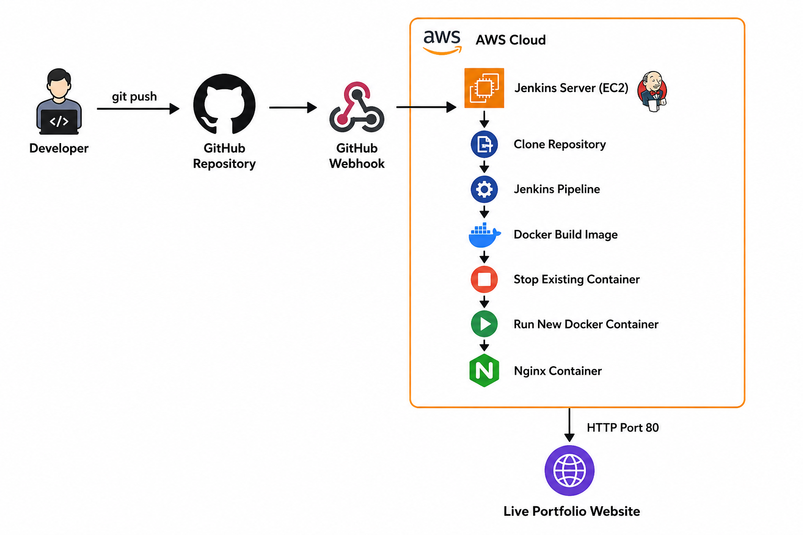
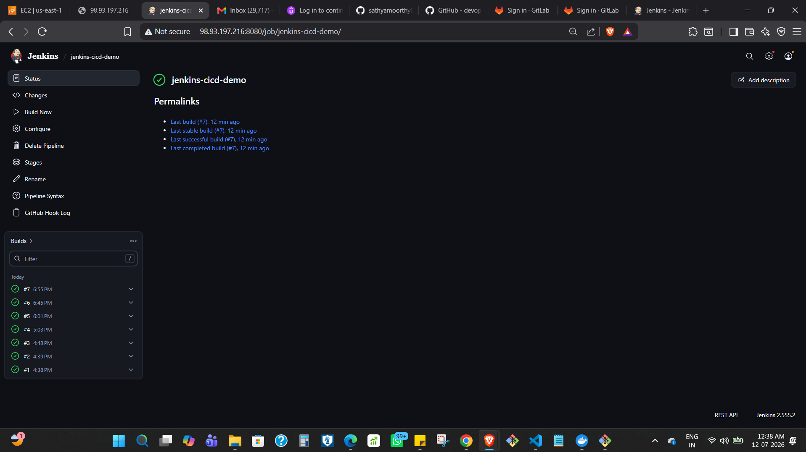
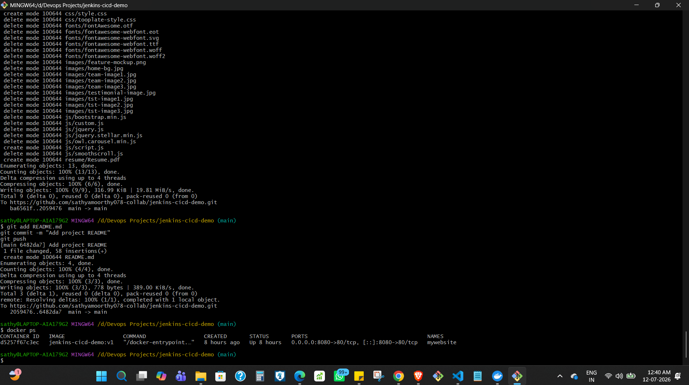
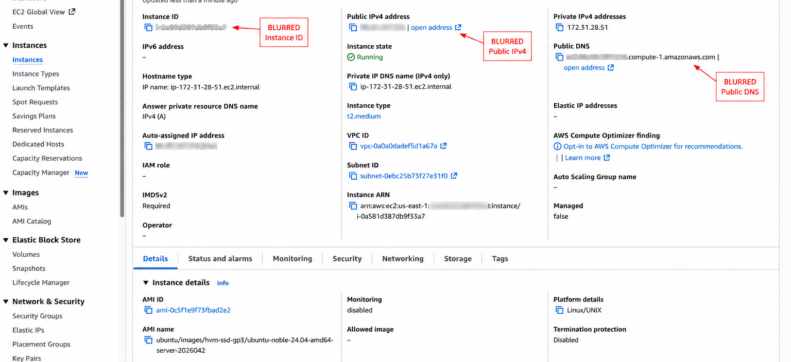
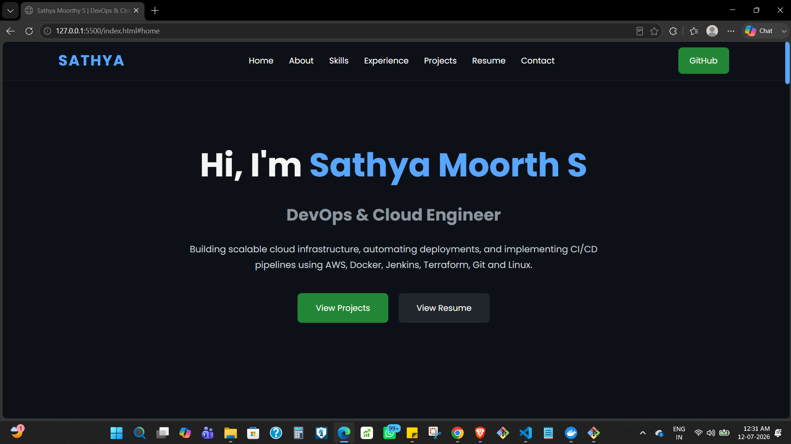

# CI/CD Pipeline with Jenkins, Docker, and AWS EC2

## Overview

This project implements an automated CI/CD workflow for deploying a containerized static portfolio website.

The application is served by Nginx inside a Docker container hosted on an AWS EC2 instance. Source code is maintained in GitHub, and a GitHub Webhook triggers Jenkins when changes are pushed to the repository. The Jenkins pipeline retrieves the latest source code, builds a new Docker image, removes the previously running application container, and starts a new container with the updated version.

The project was built to gain hands-on experience with Jenkins Pipeline as Code, webhook-based CI/CD automation, Docker containerization, and automated application deployment to a Linux-based cloud environment.

## Architecture



The deployment flow is:

1. Application code is pushed to the GitHub repository.
2. A GitHub Webhook sends a request to Jenkins.
3. Jenkins starts the pipeline defined in the `Jenkinsfile`.
4. Jenkins retrieves the latest source code.
5. Docker builds a new image containing the static website and Nginx.
6. The existing application container is stopped and removed.
7. A new container is started from the newly built image.
8. Nginx serves the updated website from the EC2 instance.

The pipeline automates application deployment after the initial Jenkins, Docker, webhook, and EC2 environment configuration has been completed.

## Technology Stack

| Technology | Role in the Project |
|---|---|
| Git | Source code version control |
| GitHub | Repository hosting and source code management |
| GitHub Webhooks | Triggers the Jenkins pipeline when code changes are pushed |
| Jenkins | Executes the CI/CD pipeline |
| Jenkinsfile | Defines the deployment workflow as code |
| Docker | Builds and runs the application as a container |
| Nginx | Serves the static portfolio website |
| AWS EC2 | Provides the Linux host for the deployment environment |
| Linux | Operating environment for Jenkins and Docker |

The primary technical focus of this project is the Jenkins and Docker-based CI/CD workflow. EC2 is used as the cloud-hosted Linux environment for running the deployment rather than as a demonstration of advanced AWS infrastructure design.

## Key Features

- Jenkins Pipeline defined as code using a `Jenkinsfile`
- Automatic pipeline triggering through GitHub Webhooks
- Docker image creation as part of the deployment workflow
- Containerized static website served through Nginx
- Automated replacement of the existing application container
- Application hosted on a cloud-based Linux environment

## Repository Structure

```text
jenkins-cicd-demo/
│
├── Dockerfile
├── Jenkinsfile
├── README.md
├── architecture.png
├── index.html
├── css/
├── js/
├── images/
├── resume/
└── screenshots/
    ├── github-repository.png
    ├── jenkins-console.png
    ├── jenkins-success.png
    ├── docker-container.png
    ├── aws-ec2.png
    ├── Home-page.png
    ├── projects.png
    └── Resume.png
```

The main deployment-related files are:

- `Dockerfile` — defines the container image used to serve the static website through Nginx.
- `Jenkinsfile` — defines the Jenkins pipeline responsible for building and redeploying the application.
- `architecture.png` — provides a visual representation of the CI/CD workflow.

The repository contains additional application screenshots, but the README focuses on screenshots that provide evidence of the CI/CD workflow and successful deployment.

## Deployment Workflow

The deployment begins when a code change is pushed to GitHub.

### 1. Source Code Update

Changes to the portfolio application are committed and pushed to the GitHub repository.

### 2. Webhook Trigger

A GitHub Webhook is configured to notify Jenkins when repository changes occur. This removes the need to manually start the Jenkins job for each deployment.

### 3. Jenkins Pipeline Execution

Jenkins executes the pipeline defined in the repository's `Jenkinsfile` and retrieves the latest application source code.

### 4. Docker Image Build

The pipeline builds a new Docker image using the project's `Dockerfile`. The image packages the static website with Nginx as the web server.

### 5. Existing Container Replacement

The previously running application container is stopped and removed before the updated version is deployed.

### 6. Updated Container Deployment

Jenkins starts a new Docker container from the newly built image. Nginx then serves the updated portfolio website from the EC2 instance.

## Technical Decisions and Considerations

### Why Jenkins?

Jenkins was selected for this project to gain hands-on experience configuring and operating a self-hosted CI/CD server, integrating external GitHub webhooks, and defining deployment workflows using a `Jenkinsfile`.

GitHub Actions could provide a simpler GitHub-native CI/CD workflow for this use case. However, using Jenkins allowed me to work directly with the CI/CD server, pipeline configuration, webhook integration, and the environment where the deployment process executes.

### Pipeline as Code

The CI/CD workflow is stored in a `Jenkinsfile` alongside the application source code rather than being defined only through the Jenkins UI.

This keeps the pipeline configuration version-controlled and allows deployment workflow changes to be tracked together with application changes.

### GitHub Webhook Trigger

A webhook connects GitHub and Jenkins so that repository changes automatically initiate the deployment pipeline.

This removes the manual step of logging into Jenkins and starting a build after every code update.

### Docker-Based Deployment

The website is packaged into a Docker image with Nginx instead of copying application files directly onto the deployment host during each update.

This provides a consistent application runtime and allows the deployed application to be replaced as a containerized unit.

### Container Replacement Strategy

The pipeline deploys updates by stopping and removing the existing application container and starting a new container from the newly built image.

This is a straightforward deployment strategy suitable for the scope of this portfolio project. Because the running container is replaced during deployment, the current implementation does not provide zero-downtime releases.

A production environment requiring uninterrupted availability would need a deployment strategy such as rolling updates or blue-green deployment.

## Verification

The implementation was verified at multiple stages of the deployment workflow.

The following were tested during the project:

- GitHub Webhook successfully triggered the Jenkins job.
- Jenkins pipeline completed successfully.
- Docker image was built through the pipeline.
- The existing application container was replaced during deployment.
- A new container was started from the updated image.
- The deployed portfolio website was accessible from the EC2-hosted environment.
- Application changes were reflected after the automated deployment workflow completed.

The running application container can be verified on the deployment host with:

```bash
docker ps
```

Jenkins build history and console output can be used to verify pipeline execution and review the individual deployment stages.

## Project Screenshots

The screenshots below provide evidence of the pipeline execution, container deployment, hosting environment, and deployed application.

### Successful Jenkins Pipeline



Confirms successful completion of the Jenkins pipeline.

### Running Docker Container



Shows the application container running after deployment.

### AWS EC2 Deployment Environment



Shows the EC2 instance used as the Linux deployment host.

### Deployed Portfolio Website



Shows the portfolio website served by Nginx from the deployed Docker container.

## Limitations and Next Steps

The project currently uses a simple deployment model appropriate for demonstrating the core CI/CD workflow.

Current limitations and possible next steps include:

- **Container image management:** Docker images are built as part of the Jenkins deployment workflow without an external container registry. A future iteration could publish versioned images to a registry and deploy specific image versions.

- **Deployment availability:** The existing container is replaced during deployment, which can introduce brief downtime. A rolling or blue-green deployment approach could be explored for zero-downtime releases.

- **Pipeline validation:** The current pipeline focuses on build and deployment automation. Automated validation or testing could be added as a pipeline stage before deployment.

- **Infrastructure provisioning:** The deployment environment is configured separately from the application pipeline. Infrastructure as Code could be used to make infrastructure provisioning repeatable.

- **Monitoring:** Application and infrastructure monitoring are outside the current project scope. Monitoring and alerting could be introduced if the deployment were extended beyond the current learning environment.

These are intentionally kept outside the current implementation so that this project remains focused on its primary objective: building and verifying an automated GitHub → Jenkins → Docker deployment workflow.

## Author

**Sathya Moorthy S**

DevOps & Cloud 

